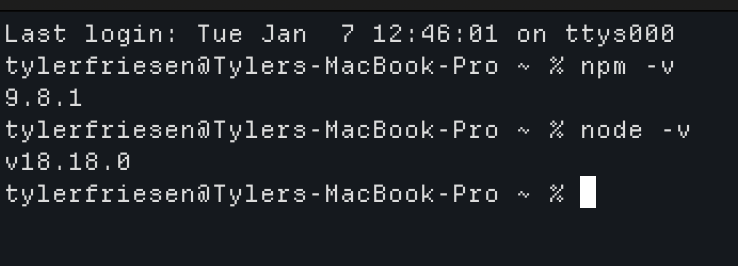
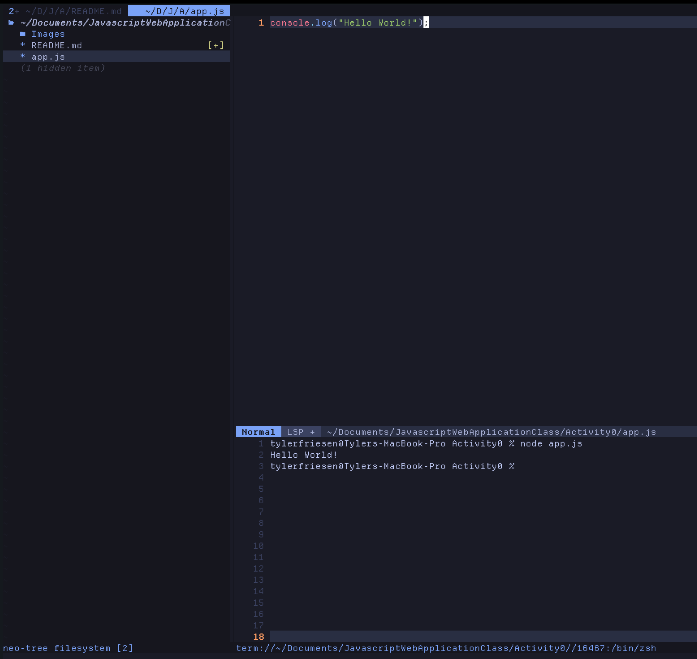
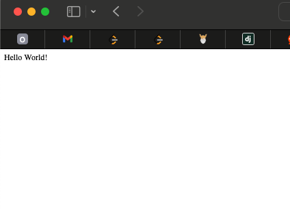
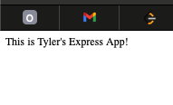
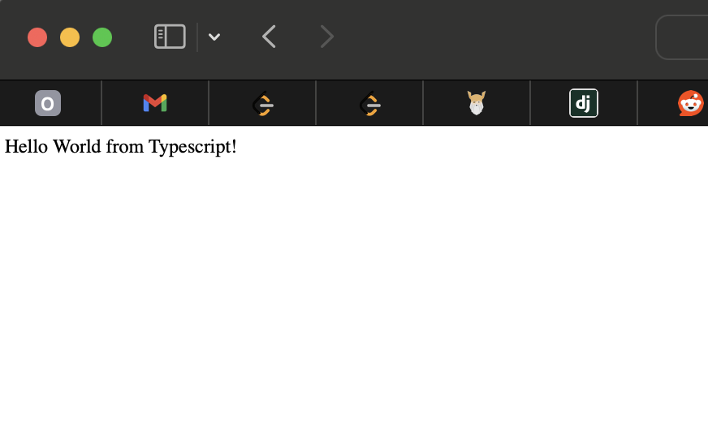
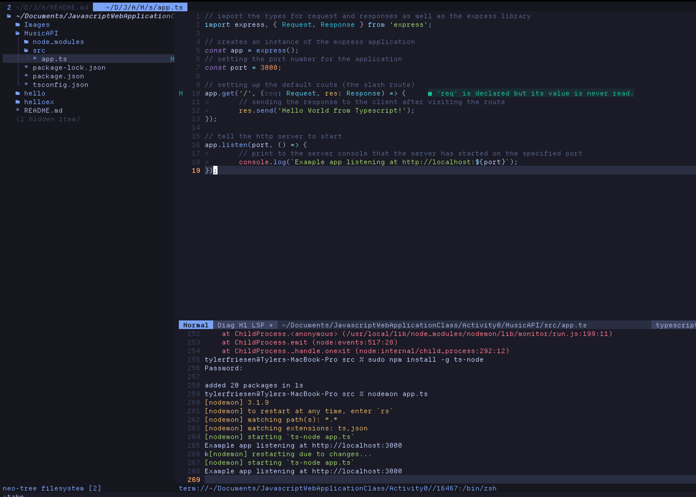

# CST391 - Activity 0
- Date 2025 January 8
- Author: Tyler Friesen

## Part 1

### Proof that npm and node are installed

---

### Running a simple "Hello World" console application

---

### Hello World Express Application

---

### Express server running with nodemon

---

### Express server running using typescript

---

### Express server code for typescript

