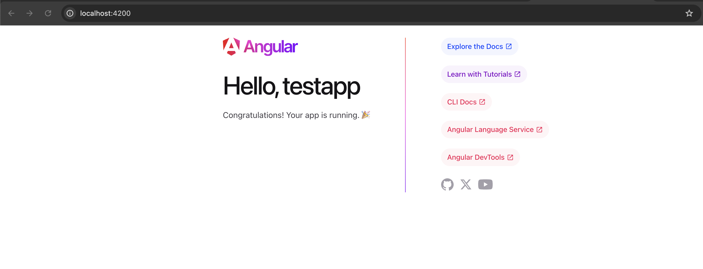
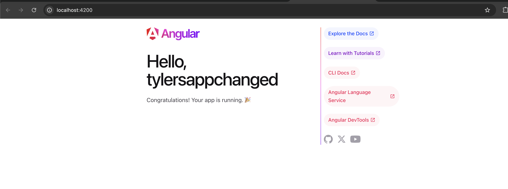
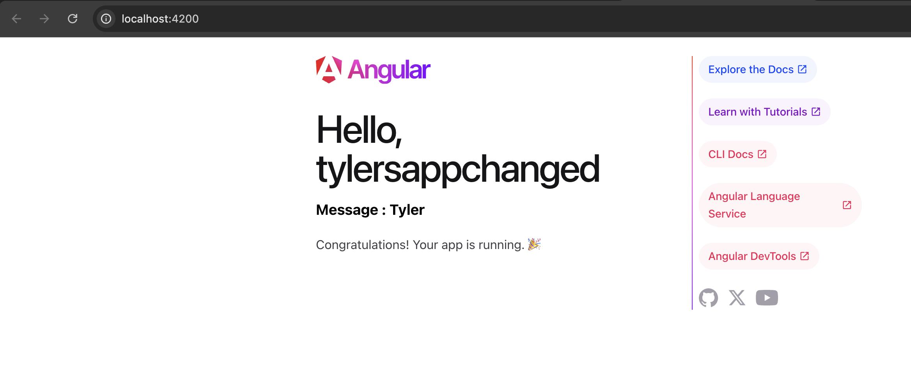

# Activity 2

## Angular applicaton up and running

## Angular application after changing the title

## Angular application after adding a variable to the export list 'message'

# Research Questions

# 1.

Purpose of Folders/Files in the Default Angular Project Structure:

node_modules: This folder contains all the dependencies and libraries that the Angular project requires to run. These dependencies are installed using npm install and listed in the package.json file.

src: The src folder is where the application code resides. It contains all the TypeScript, HTML, CSS, and other assets that make up the Angular app.

src/app: This is the main folder where the core components, services, modules, and other Angular-related files for the application reside. In a typical Angular project, this folder contains the majority of your logic and UI components.

src/assets: This folder is used to store static assets like images, fonts, styles, etc. These files are accessible from the application, and they won't be modified during the build process.

src/environments: This folder contains environment-specific configurations. It generally holds files like environment.ts and environment.prod.ts which store variables and settings for different environments like development and production. For example, the development environment could have different API URLs compared to production.

angular.json: This file is the configuration file for the Angular CLI. It defines the settings for the project, including build and test configurations, styles, scripts, and how the Angular application will be served. It also includes specific paths, assets, and other necessary parameters for the project.

package.json: This file is the metadata file for the project, which includes the project name, version, dependencies, and scripts. It lists all the external libraries required by the Angular project, including Angular itself. It also contains scripts for running the build and serving the application.

tsconfig.json: This is the TypeScript configuration file. It defines how TypeScript code will be compiled into JavaScript. It includes compiler options such as the module system, output directory, and TypeScript version. The tsconfig.json file is crucial for ensuring the TypeScript code is compiled correctly.

---

# 2.

Looking at the page source, these are the main files responsible for generating the content (and their functionality explained.)

main.ts: This is the entry point for the Angular application. It initializes the app and bootstraps the root module (AppModule) to launch the Angular application. The main.ts file is the starting point for all Angular apps.

app.component.css: This file holds the styles (CSS) that are specific to the AppComponent. The styles defined in this file are scoped to this component only, making it modular and maintainable. They are automatically applied when the component is rendered.

app.component.html: This is the HTML template for the AppComponent. It defines the structure and content of the component's view. The content here could include Angular directives, bindings, and other components. It is dynamically rendered in the browser by Angular.

app.component.ts: This is the TypeScript file for the AppComponent. It contains the logic for the component, including its properties, methods, and lifecycle hooks. It defines the component's behavior and holds properties like the title that are used in the template (e.g., {{ title }}).

app.module.ts: This is the root module of the Angular application. It defines the AppComponent and other necessary configurations for the app. It includes declarations for the components, imports for external modules (like BrowserModule), and providers for services. The module connects the components, services, and other code together.
