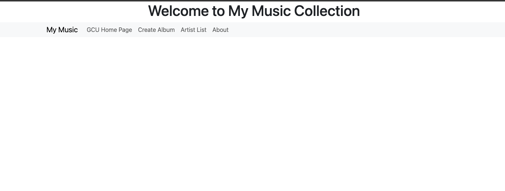

# Activity 3
# Tyler Friesen CST-391
# February 23rd 2025

# Part 1

---

<figure>
    
    <figcaption>Responsive grid large</figcaption>
</figure>

---

<figure>
    
    <figcaption>Responsive grid small</figcaption>
</figure>

---

<figure>
    
    <figcaption>Form before a name is entered (I removed the grid we created in the app component to declutter)</figcaption>
</figure>

---

<figure>
    
    <figcaption>Form after a name has been entered, shows the InfoComponent</figcaption>
</figure>

---

<figure>
    
    <figcaption>The browser console output clicking through the whole application so far</figcaption>
</figure>

---

## Research

1. The @Input decorator is used so that we can pass in inputs from other components. It works similar to props from React.
In our project we use the @Input decorator in our info.component.ts. If we hop on over to our shop component inside the HTML
template we notice that we use a app-info tag. This allows us to include the InfoComponent inside our ShopComponent. On our
InfoComponent tag we pass an argument called name. Whatever value we decide to put here will populate the name field in the 
InfoComponent. In simple terms it allows a child component to communicate with its parent.

2. [value] in InfoComponent binds each product in the products array to the value of that option. The square brackets indicate
we would like to bind the property of an html element to a particular variable within a component. This allows our templates
to be more dynamic, reflecting the state of the component.

3. [(ngModel)] in InfoComponent is called two-way data binding. It allows both property binding and event binding to take place
at once. (for just event binding you would only use the parenthesis). This means that when the quantity field in the form is updated
the component's quantity field is updated to reflect that change.

---

# Part 2

---

<figure>
    
    <figcaption>The home page for the angular application in part 2</figcaption>
</figure>

---

<figure>
    
    <figcaption>After clicking on the GCU link in the navbar</figcaption>
</figure>

---

<figure>
    
    <figcaption>The create album form/page</figcaption>
</figure>

---

<figure>
    
    <figcaption>The display albums page, you can see the one I added</figcaption>
</figure>

---

<figure>
    
    <figcaption>The alert box after clicking the about button, shows the site version</figcaption>
</figure>

---

## Research

I am not pasting code here because that seems stupid. You can check out the music-service.service.ts for all the comments that were added
