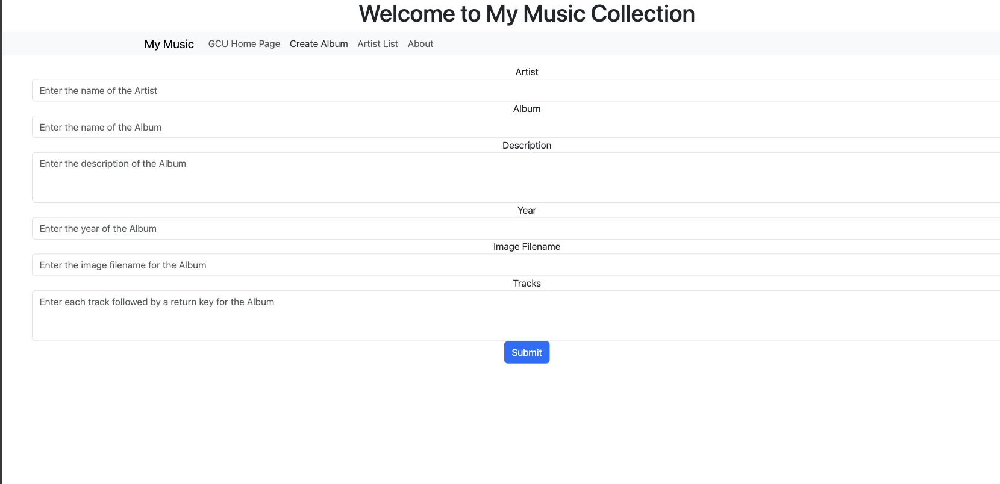

# Activity 3
# Tyler Friesen CST-391
# March 9rd 2025

# Part 1

## Introduction
In this assignment, I integrated the front-end Angular Music application with the back-end Express MusicAPI, created in a previous topic. The integration replaces hard-coded data with live data fetched from the API using Angular's HttpClient module. The focus was on modifying the music service (music-service.service.ts) to connect with the back-end API, retrieve data asynchronously using Observables, and ensure the user interface dynamically reflects this live data. This process also required refactoring existing components to handle the new data flow and adapting the application's behavior to work with a real-time API.

---

<figure>
    
    <figcaption>This is the angular view that shows the list of artists we can click on. It retrieves the list of artists from the database and uses it to populate the page.</figcaption>
</figure>

---

<figure>
    
    <figcaption>This is the angular view that allows the creation of an album, the user can enter all the relevant info from an album. It then makes an SQL query to add the record to the DB.</figcaption>
</figure>

---

<figure>
    
    <figcaption>The default home page for the angular application.</figcaption>
</figure>

---

<figure>
    
    <figcaption>This view is inside the artist list view. When clicking on a specific album from an artist this page will populate and retrieve the album data from the database.</figcaption>
</figure>

---

<figure>
    
    <figcaption>This view is inside the album list view. When clicking on a specific track for an album this page will populate and retrieve the specific tracks from the database. Technically it doesn't open a new page, it just adds the html elements to the existing page.</figcaption>
</figure>

---

## Conclusion
By completing this assignment, I successfully integrated the Music application's front end with the back-end API, enabling the display and manipulation of live data for artists and albums. The refactoring involved the use of Angular's HttpClient module to replace hard-coded values with data retrieved via asynchronous API calls, allowing for more dynamic and realistic application behavior. This experience deepened my understanding of Angular's Observables, asynchronous programming, and the importance of streamlining client-server communication. With the application now fully functional and integrated, it provides a more robust user experience.

## Research

1. In an Angular application, maintaining a logged-in state typically involves both client-side storage and communication with a backend server. When a user logs in, the application sends a request to the backend with the user's credentials (such as username and password). The backend then verifies the credentials and, if valid, generates a token (commonly a JSON Web Token or JWT), which it sends back to the client. The client stores this token in `localStorage` or `sessionStorage` to maintain the logged-in state across page refreshes or browser sessions. `localStorage` retains the token even after the browser is closed, while `sessionStorage` is cleared when the session ends.

To manage the logged-in state, Angular often employs route guards to protect routes that require authentication. These guards check if the user has a valid token before allowing access to the protected route, redirecting unauthorized users to the login page. Additionally, Angular uses HTTP interceptors to automatically include the JWT in the `Authorization` header for every outgoing API request. This ensures that the backend can authenticate the user with each request by validating the token, which contains the user’s identity and any relevant permissions.

The server checks the validity of the JWT and ensures it hasn’t expired or been tampered with. To handle token expiration, many applications use a refresh token system. While the access token (JWT) has a short lifespan, the refresh token is longer-lived and can be used to obtain a new access token when the old one expires. If the access token is expired, the application sends the refresh token to the server to obtain a new one, maintaining the user’s logged-in state without requiring them to log in again. 

Finally, when the user logs out, the application removes the token from `localStorage` or `sessionStorage`, effectively ending the session. Without the token, subsequent API requests will be unauthenticated, and the user will be treated as logged out. This combination of storing the token, using interceptors and route guards, validating tokens on the backend, and handling token refreshes ensures a smooth and secure user experience in Angular applications.
