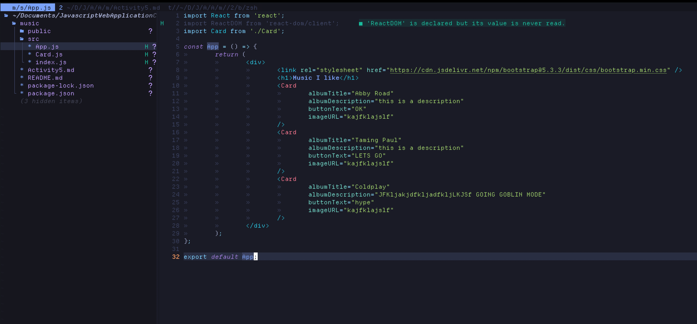
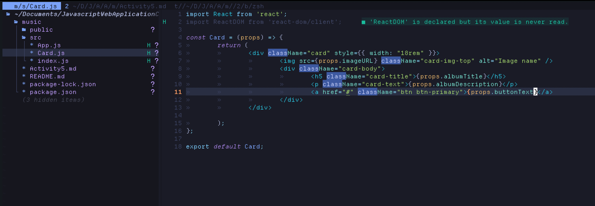
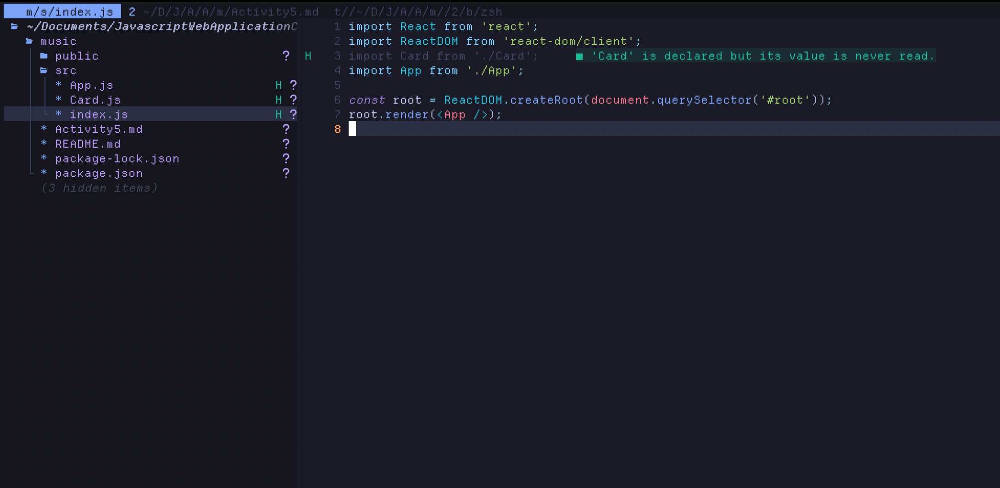
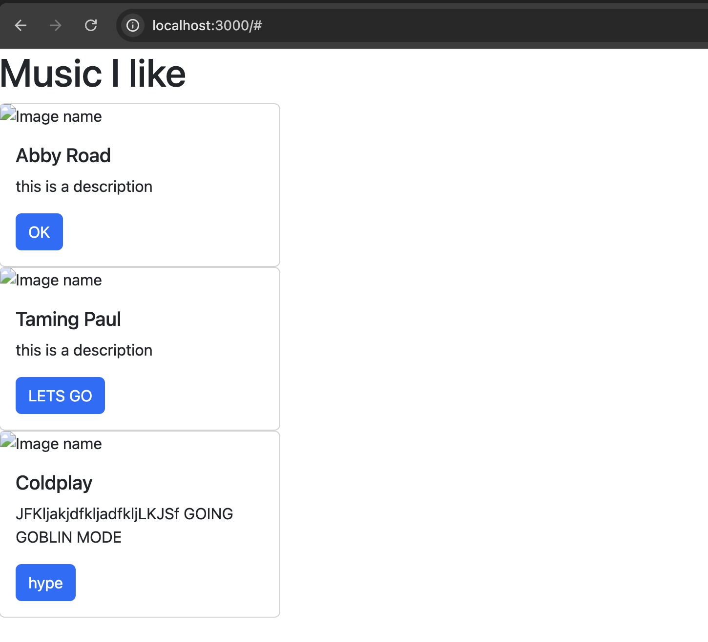
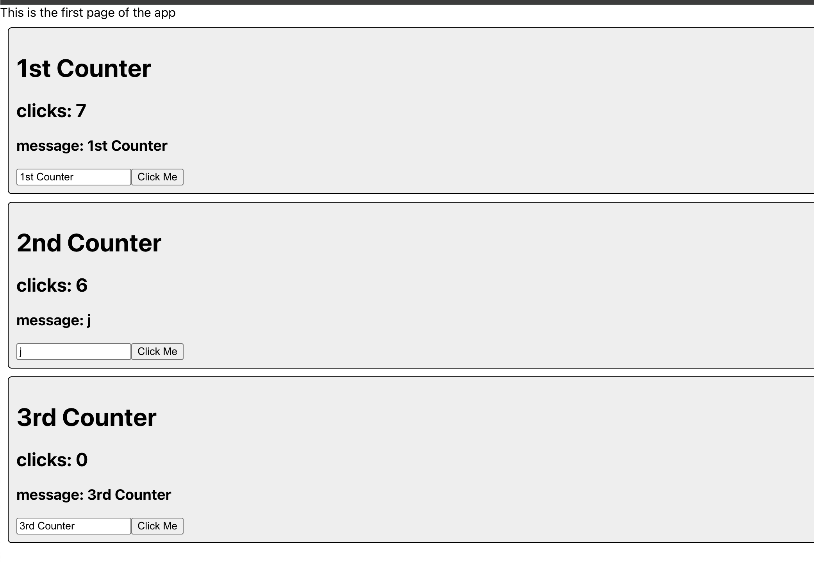
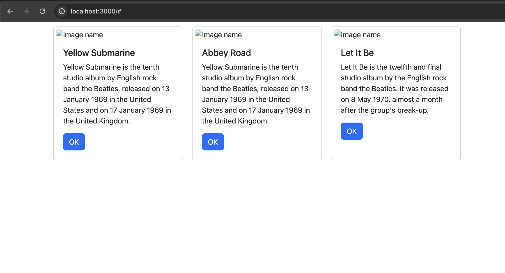

# Activity 5 Javascript Web Applications
# Tyler Friesen
# 24 March 2025

# Part 1

### Code for the app component

### Code for the card component

### Code for the Index

### The app running in the browser with the three cards that have been dynamically injected with data

### Summary
The main things added in this activity so far was creating a react app, creating our own components, dynamically injecting the components
with data using props, and using bootstrap in our components

# Part 2 (Counter App)

### The Counter application as displayed in the browser, we are using useState() to create variables that our application watches for so that when the variable is updated the DOM does too to reflect the change. Any time a useState() variable is updated a rerender occurs

# Part 3 (finishing the music react app)

### This is the app all completed, notice that now we have added css flexbox so that the elements are horizontal as opposed to vertical

### Summary
In this lesson we revisited the music app and are mapping our useState() variables to the props in the Card components.
Basically what this does is it allows the page to automatically rerender anytime the contents of the cards update. We also used the map()
function which is a builtin function to Javascript. It basically acts as a for loop but more compact version. It will iterate through
all the elements of the specified collection and then return a new collection with modifications performed according to the passed callback
function.
