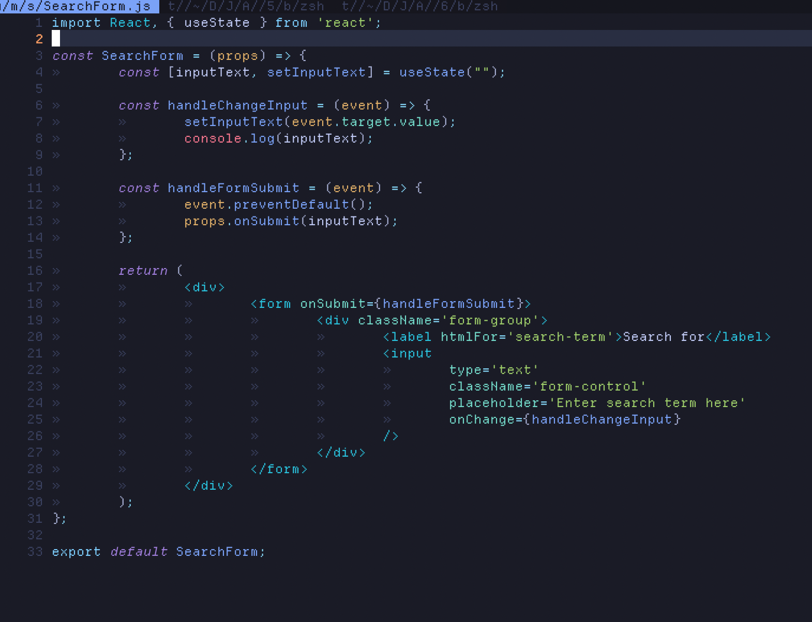
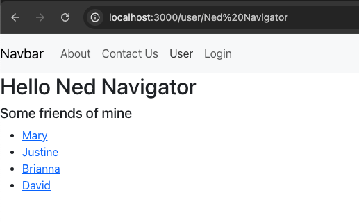

# Activity 5 Javascript Web Applications
# Tyler Friesen
# 24 March 2025

# Part 1

### UI of the application

### demonstrating the search functionality 

### App.js code

### SearchForm.js code

### Summary
The main thing that we did in this activity was to create UI in react for our MusicAPI that we created in activity1.
We added the card display functionality as well as the ability to search for a specific album/card using a search box.
This all occurs without needing a page reload.

# Part 2 (Routing App Demo)

### this is the home page while the user is logged out

### this is what the page looks like when viewing a friend's profile

### this is what the page looks like when a signed out user attempts to visit a protected route

### This is what the page looks like when a signed in user attempts to visit the about page

### This is what the page looks like when a signed in user attempts to visit the user page

### Summary
In this activity we set up a React application that makes use of react routing. This allows us have multiple pages (which are rendered via components) that can be loaded from the application. We also implemented protected routes. If the user has not logged themselves in then they will not be able to see the full page contents. However if they do log in then they will be served the full page contents.

# Part 3 Navigation routing

### this is the home page of the site, notice that now there is a navbar that was not present before and that it has a link to a different page showing off the new routing functionality

### This is demonstrating the music search functionality. This has not really changed from when we implemented this in the first part of the activity except for the fact that this display also shows the navbar.

### This is the /new route that the navbar redirects to. In the future there will be a form rendered here, but right now the HTML is just a placeholder demonstrating the routing capability of the app now.

### Summary
This app is more or less unchanged from the previous one. All we did was return to our music React application and add the Navbar and the routing capabilities that we showed in the previous section (Routing app demo). This should set up the music app nicely for the next activity where I presume we will actually add the forms for submitting new albums to the database among other CRUD operations.
