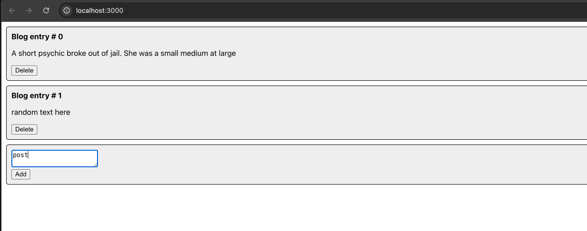
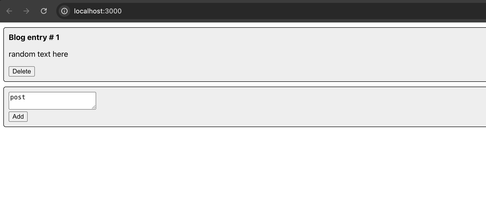
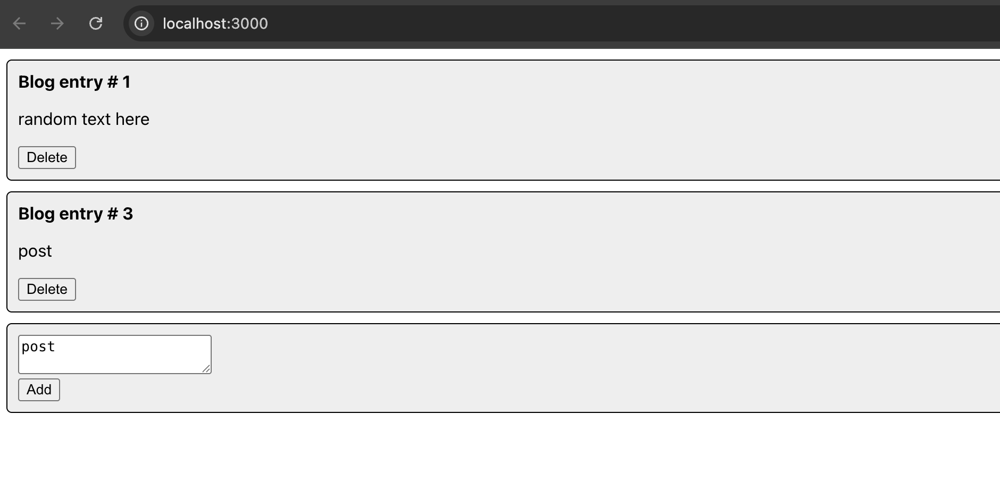
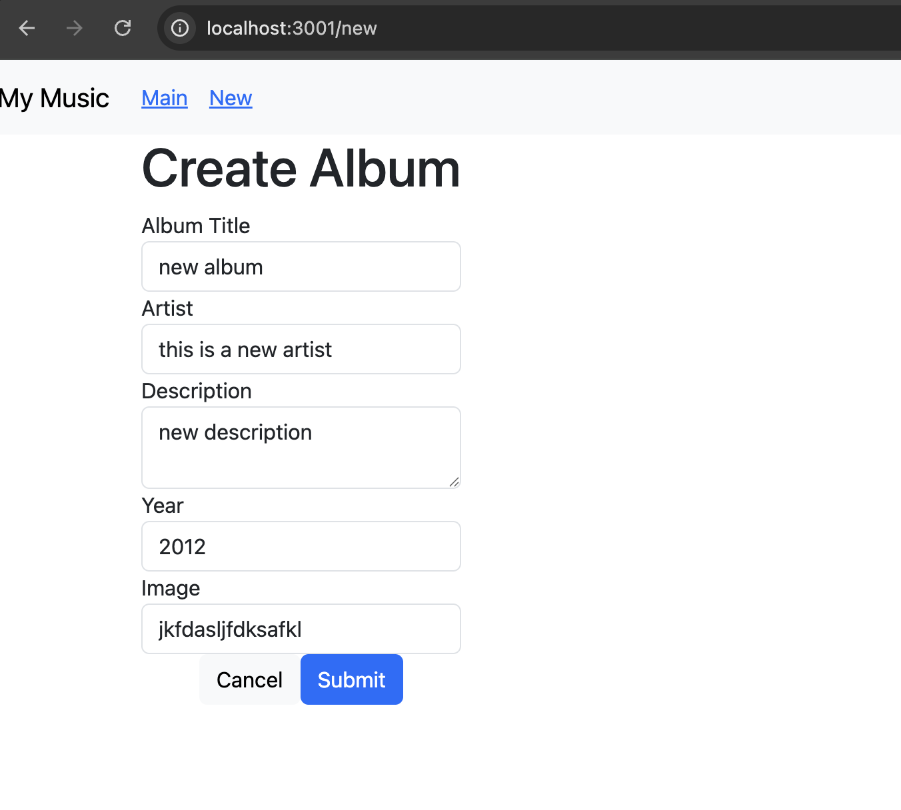
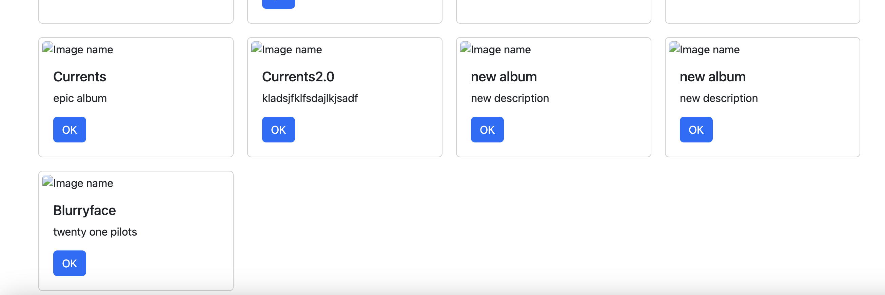
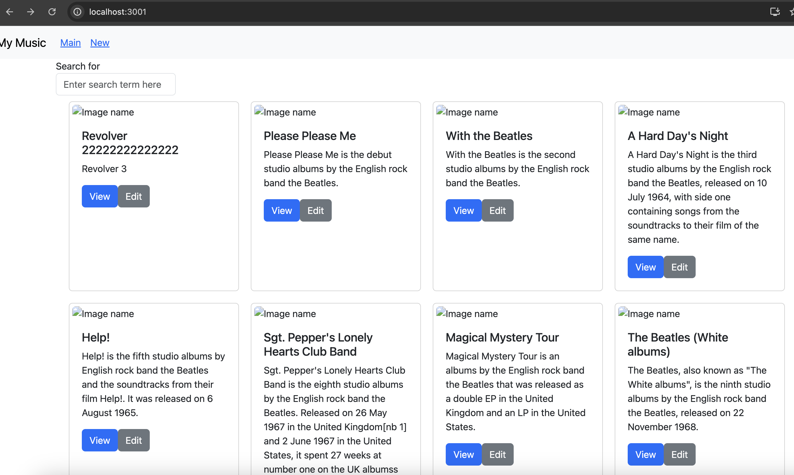
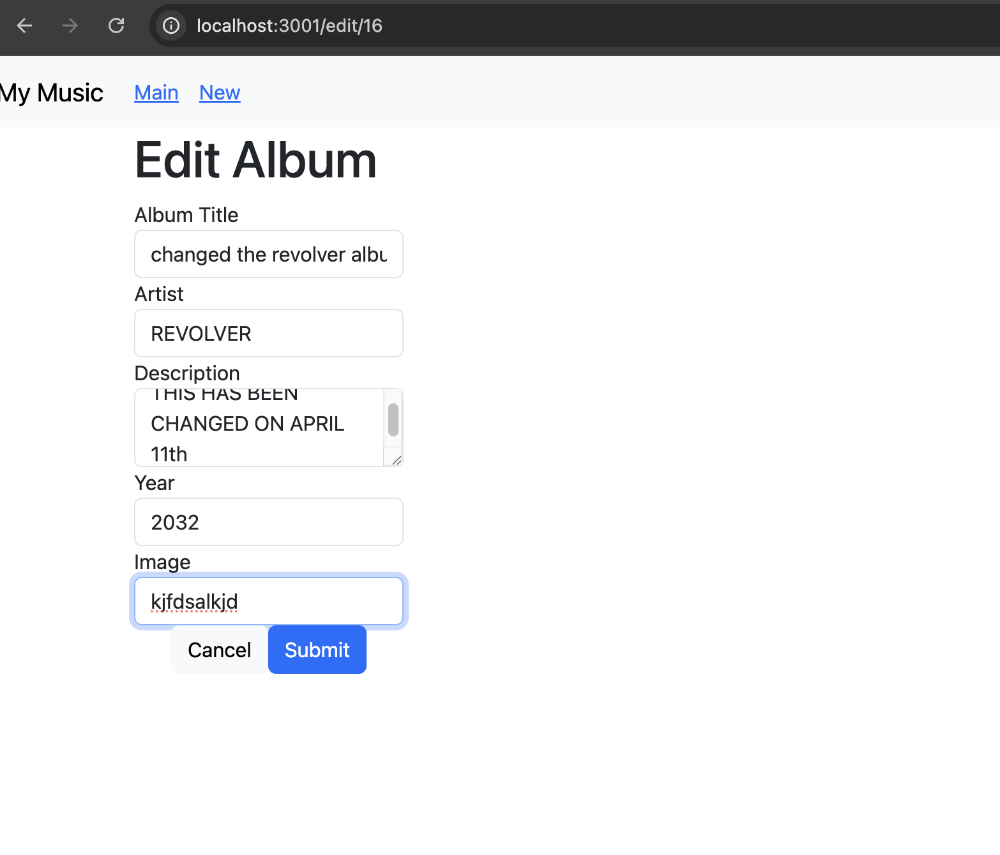
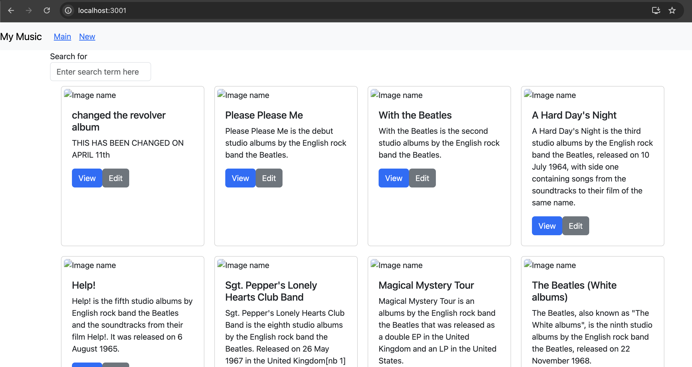

# Activity 7 Javascript Web Applications
# Tyler Friesen
# 10 April 2025

# Part 1

### UI of the application

### Deleting a post

### Adding a new Post

# Part 2

### the activity document said this section was optional

# Part 3

### Adding a new album form

### the home page after adding the new album (you can see it here)

## Summary
In this section of the application, we focus on implementing a dynamic form component that enables users to input data directly into the interface. This form is designed to be interactive and responsive, meaning it can adapt to various types of user input in real time. As users fill out the fields within the form, we capture their input and store it in state variables using React’s state management system, typically through the useState hook or similar mechanisms. These state variables serve as a temporary holding space for the form data, allowing us to manage and manipulate the input as needed throughout the component lifecycle.

Once the user completes the form and submits it—usually by clicking a submit button—the application takes the collected data and sends it to the backend or database via a POST request. This process ensures that the user-generated content is not only handled on the client side but also persisted in the application's data storage for future access. After successfully posting the data, the updated information can be retrieved and rendered dynamically in the main App component, providing real-time feedback and interactivity within the user interface.

# Part 4

### Home page with the new Edit buttons from the new album editing functionality

### Editing an album

### Home page after making edits to the first album in the list

## Summary
In this part of the application, I implemented the ability to edit an existing album in the music application. To accomplish this, I created a new component called `editAlbum.js` in the React application, which handles the form and functionality for updating album details such as the title, artist, and release year. This feature improves the user experience by allowing albums to be easily updated without needing to delete and recreate them.
