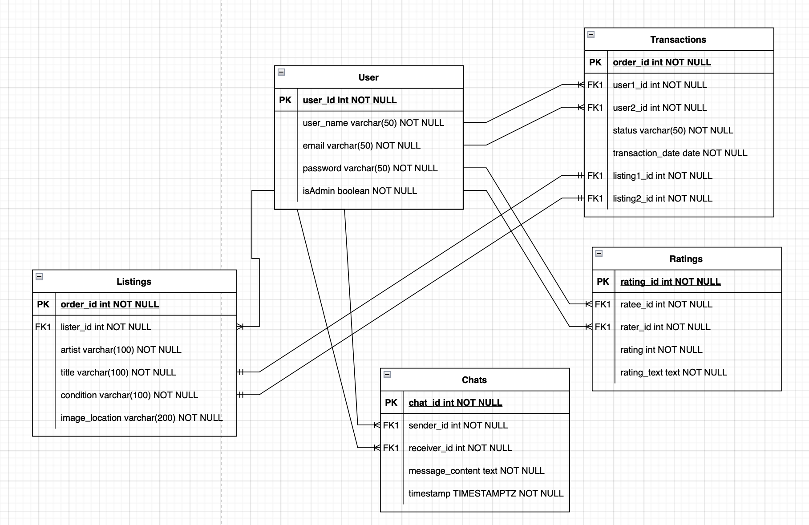
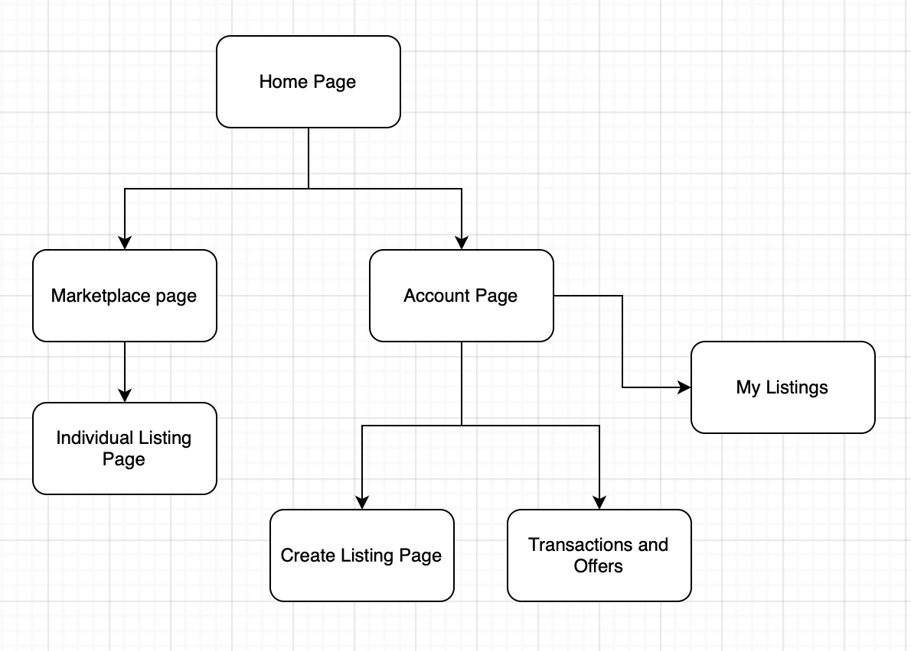
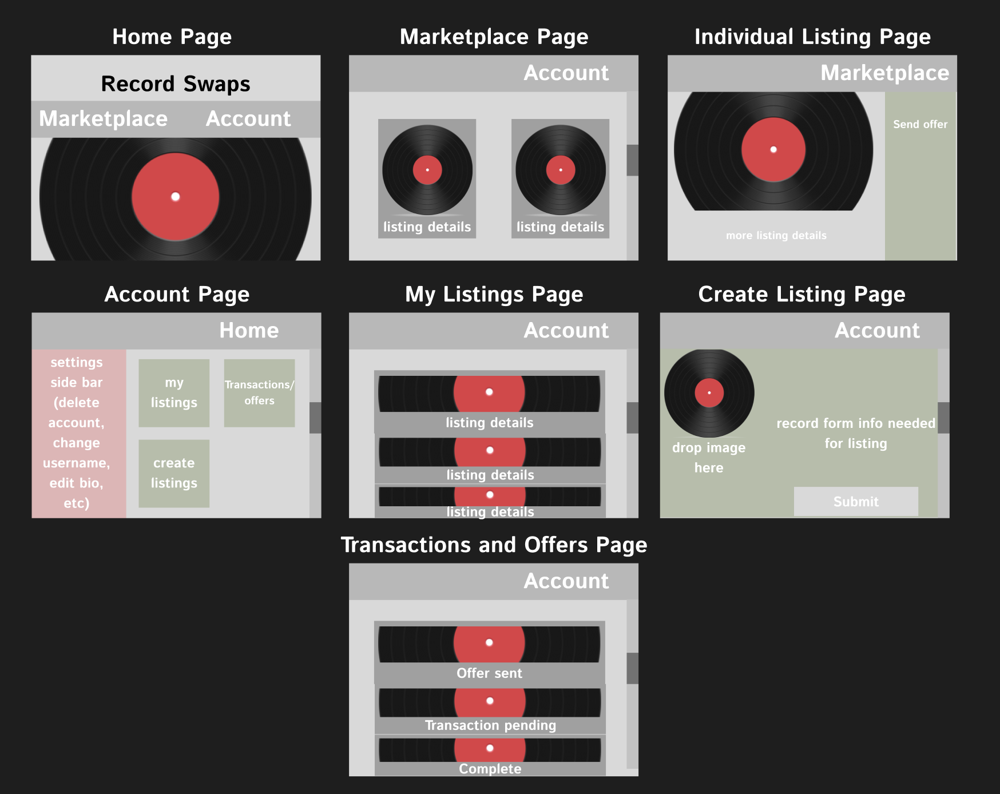

# CST-391 - Javascript Web Applications - Project Proposal
- Application Name: 
- Author: Tyler Friesen

## Introduction
The milestone project being developed for this class is a vinyl record swap-meet. Users will be able to create listings on the site listing their record for trade. Other users will be able to browse and sort through the listings on the site to find records they may want to trade for.

Once a user has found a record they want to trade for they can offer up a record of their own to the user in a chat. These two users can haggle and argue to their heart's content until they either come to an agreement or part ways. Users can also be rated by other users based on whether they have fair and honest transactions.

## Functionality Requirements
- User Registration and Authentication
  - As a user, I want to be able to create an account with a username, email, and password, so that I can log in and access the platform.
  - As a user, I want to be able to log in and log out of my account, so that I can manage my listings and offers.
  - As a user, I want to reset my password if I forget it, so that I can regain access to my account.
- Profile Management
  - As a user, I want to create and edit my profile, so that other users can view information about me, such as location and my favorite genres.
  - As a user, I want to be able to view my trade history, so that I can see past transactions and ratings from other users.
- Create and Manage Listings
  - As a user, I want to create a listing by providing details about the vinyl record I want to trade (artist, album title, condition, etc.), so that other users can view and consider my record for trade.
  - As a user, I want to be able to edit or delete my listings, so that I can manage the records I am offering.
  - As a user, I want to be able to upload images of my vinyl records, so that other users can see the condition of the records before trading.
  - As a user, I want to tag my listing with genres (e.g., rock, jazz, hip-hop), so that others can find it when browsing by genre.
- Browse and Search Listings
  - As a user, I want to browse through the available records listed by other users, so that I can find records I am interested in.
  - As a user, I want to filter listings by genres, artists, condition, or location, so that I can narrow down my search for records I want.
  - As a user, I want to sort listings by date, condition, or popularity, so that I can find the most relevant records quickly.
- Offer and Trade Mechanism
  - As a user, I want to select a record I am interested in and offer one of my own records in exchange, so that I can initiate a trade.
  - As a user, I want to engage in a chat with the listing owner to discuss the details of the trade, so that we can negotiate and potentially agree on a deal.
  - As a user, I want to see a history of offers and chats I have made or received, so that I can keep track of ongoing trades.
- Rating and Feedback System
  - As a user, I want to rate other users after a trade is completed, so that I can give feedback on the fairness and honesty of the transaction.
  - As a user, I want to view the ratings and reviews of other users before trading with them, so that I can assess whether they are trustworthy.

## Initial Database Design

## Initial UI Sitemap

## Initial UI Wireframes

## Initial UML Classes

## Risks
- Time Management
  - Risk: The development process might take longer than expected, especially with the limited timeframe of a class project.
  - Mitigation: Break down the project into clear, achievable milestones with deadlines. Use project management tools (e.g., Trello, Jira) to track progress and maintain focus on the most critical features. Avoid scope creep by sticking to core functionality.
- Feature Creep
  - Risk: Poor version control practices can lead to conflicts, overwritten code, and difficulty tracking progress.
  - Mitigation: Use a version control system (e.g., Git) effectively, with frequent commits, clear commit messages, and proper branching strategies (e.g., feature branches, pull requests) to avoid issues.
- Underestimating Complexity of Features
  - Risk: Certain features (e.g., chat functionality, rating system) may turn out to be more complex than initially anticipated, leading to delays.
  - Mitigation: Break complex features into smaller, more manageable tasks and prototype early. Consult with peers or instructors if a feature becomes challenging and seek alternatives if necessary.
- Dependency on External Libraries or APIs
  - Risk: Relying on external libraries or APIs (e.g., for chat, authentication, or notifications) could introduce bugs, security vulnerabilities, or unexpected behaviors.
  - Mitigation: Research and choose well-documented, widely-used libraries with active community support. Test dependencies thoroughly, and stay updated on potential issues or patches.
