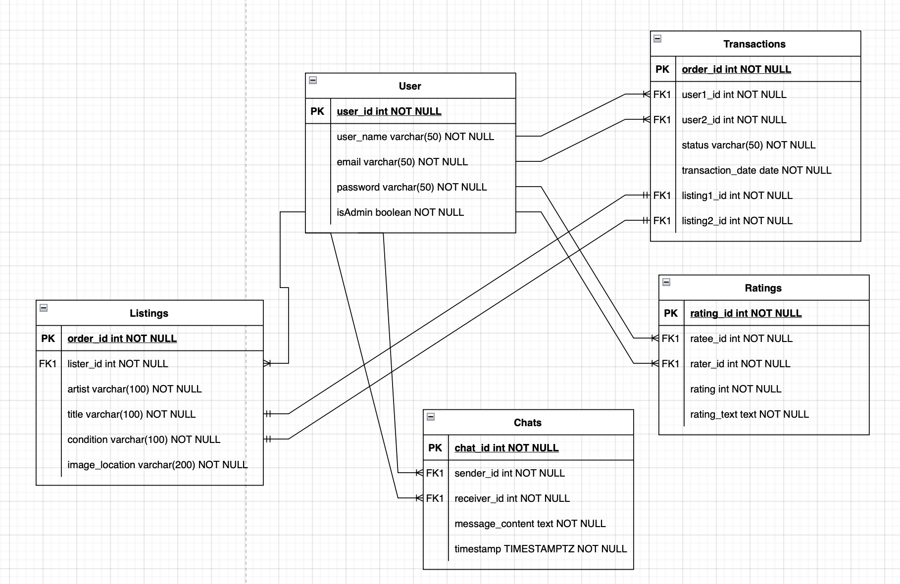
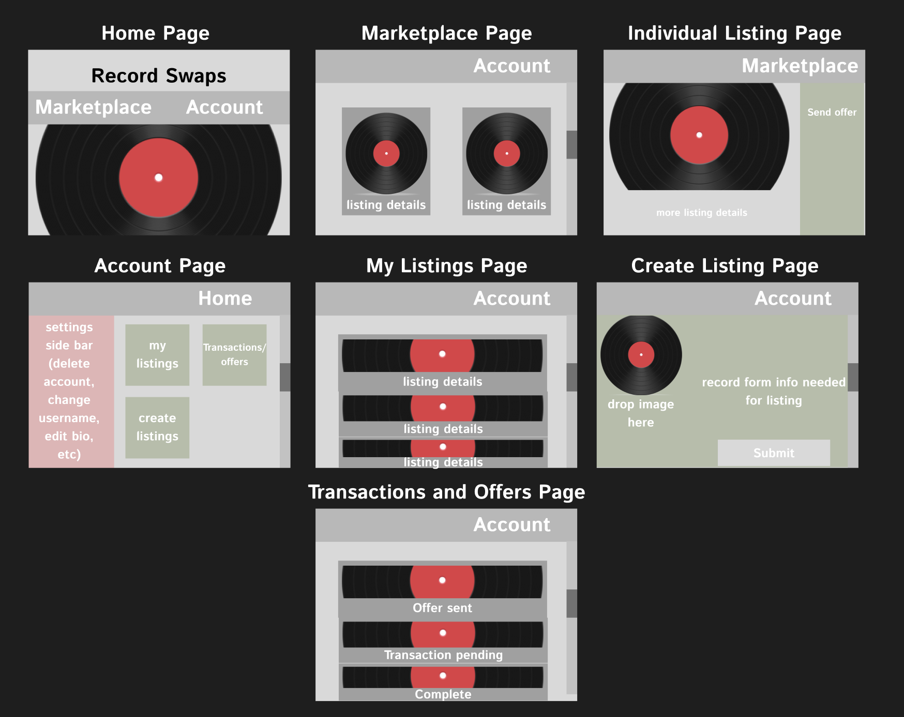

# CST-391 - Javascript Web Applications - Project Proposal
- Application Name: Vinyl Record Swap Meet
- Author: Tyler Friesen

## Instructor Feedback
> Tyler, can you post this assignment on a git server so that you don't have to 
> send me a zip file and instead send me a link.  If you need assistance, I can help you.  

I have now uploaded my activities and this milestone solution to my GitHub. There was no other feedback
so I have left the design as is.

## Introduction
The milestone project being developed for this class is a vinyl record swap-meet. Users will be able to create listings on the site listing their record for trade. Other users will be able to browse and sort through the listings on the site to find records they may want to trade for.

Once a user has found a record they want to trade for they can offer up a record of their own to the user in a chat. These two users can haggle and argue to their heart's content until they either come to an agreement or part ways. Users can also be rated by other users based on whether they have fair and honest transactions.

## Functionality Requirements
- User Registration and Authentication
  - As a user, I want to be able to create an account with a username, email, and password, so that I can log in and access the platform.
  - As a user, I want to be able to log in and log out of my account, so that I can manage my listings and offers.
  - As a user, I want to reset my password if I forget it, so that I can regain access to my account.
- Profile Management
  - As a user, I want to create and edit my profile, so that other users can view information about me, such as location and my favorite genres.
  - As a user, I want to be able to view my trade history, so that I can see past transactions and ratings from other users.
- Create and Manage Listings
  - As a user, I want to create a listing by providing details about the vinyl record I want to trade (artist, album title, condition, etc.), so that other users can view and consider my record for trade.
  - As a user, I want to be able to edit or delete my listings, so that I can manage the records I am offering.
  - As a user, I want to be able to upload images of my vinyl records, so that other users can see the condition of the records before trading.
  - As a user, I want to tag my listing with genres (e.g., rock, jazz, hip-hop), so that others can find it when browsing by genre.
- Browse and Search Listings
  - As a user, I want to browse through the available records listed by other users, so that I can find records I am interested in.
  - As a user, I want to filter listings by genres, artists, condition, or location, so that I can narrow down my search for records I want.
  - As a user, I want to sort listings by date, condition, or popularity, so that I can find the most relevant records quickly.
- Offer and Trade Mechanism
  - As a user, I want to select a record I am interested in and offer one of my own records in exchange, so that I can initiate a trade.
  - As a user, I want to engage in a chat with the listing owner to discuss the details of the trade, so that we can negotiate and potentially agree on a deal.
  - As a user, I want to see a history of offers and chats I have made or received, so that I can keep track of ongoing trades.
- Rating and Feedback System
  - As a user, I want to rate other users after a trade is completed, so that I can give feedback on the fairness and honesty of the transaction.
  - As a user, I want to view the ratings and reviews of other users before trading with them, so that I can assess whether they are trustworthy.

## Initial Database Design



## Initial UI Sitemap


## Initial UI Wireframes



## Initial UML Classes


## Risks
- Time Management
  - Risk: The development process might take longer than expected, especially with the limited timeframe of a class project.
  - Mitigation: Break down the project into clear, achievable milestones with deadlines. Use project management tools (e.g., Trello, Jira) to track progress and maintain focus on the most critical features. Avoid scope creep by sticking to core functionality.
- Feature Creep
  - Risk: Poor version control practices can lead to conflicts, overwritten code, and difficulty tracking progress.
  - Mitigation: Use a version control system (e.g., Git) effectively, with frequent commits, clear commit messages, and proper branching strategies (e.g., feature branches, pull requests) to avoid issues.
- Underestimating Complexity of Features
  - Risk: Certain features (e.g., chat functionality, rating system) may turn out to be more complex than initially anticipated, leading to delays.
  - Mitigation: Break complex features into smaller, more manageable tasks and prototype early. Consult with peers or instructors if a feature becomes challenging and seek alternatives if necessary.
- Dependency on External Libraries or APIs
  - Risk: Relying on external libraries or APIs (e.g., for chat, authentication, or notifications) could introduce bugs, security vulnerabilities, or unexpected behaviors.
  - Mitigation: Research and choose well-documented, widely-used libraries with active community support. Test dependencies thoroughly, and stay updated on potential issues or patches.


<hr style="border: 3px solid white; margin: 100px;">

## Vinyl Record Swap Meet API Documentation

This is the API documentation for the Vinyl Record Swap Meet application. The API is built following RESTful principles to ensure clean and predictable interactions. Below is a breakdown of the main endpoints and their functionalities.

## 1. User API

### POST /users/register
Allows new users to create an account by providing their username, email, and password.

**Request Body:**
```
{
  "username": "exampleuser",
  "email": "example@example.com",
  "password": "password123"
}
```

**Response:**
- Success or failure message indicating whether the account was created.

---

### POST /users/login
Allows registered users to log in to their account using their email and password.

**Request Body:**
```
{
  "email": "example@example.com",
  "password": "password123"
}
```

**Response:**
- JSON Web Token (JWT) for authentication, or error if credentials are invalid.

---

### GET /users/{userId}
Retrieves a specific user’s profile by their user ID, allowing others to see their profile, trade history, and ratings.
Can also be used without the {userId} path parameter to obtain a list of all the users

**Response:**
- User details, including username, location, favorite genres, and ratings.

---

## 2. Listing API

### POST /listings
Authenticated users can create a new listing to trade a vinyl record. The listing includes information like the artist, album title, condition, and genres.

**Request Body:**
```
{
  "artist": "Pink Floyd",
  "albumTitle": "The Dark Side of the Moon",
  "condition": "Very Good",
  "imageUrl": "link_to_image.jpg"
}
```

**Response:**
- Success message and listing details.

---

### GET /listings
Retrieves a list of all available vinyl record listings. The query parameters allow filtering and sorting by artist, condition.
can also omit the query parameters to grab all the listings

**Query Parameters:**
- `artist=Pink Floyd`
- `condition=good`

**Response:**
- A list of matching listings.

---

### PUT /listings/{listingId}
Allows authenticated users to edit an existing listing they created. They can update the album details, condition, and images.

**Request Body:**
```
{
  "condition": "Excellent",
}
```

**Response:**
- Updated listing details.

---

### DELETE /listings/{listingId}
Authenticated users can delete their own listings, removing them from the platform.

**Response:**
- Success message if deletion was successful.

---

## 3. Chat API

### POST /trades/{listingId}/chat
Initiates or continues a chat between the two users discussing a trade for a specific listing.

**Request Body:**
```
{
  "message": "Would you be willing to trade for my Led Zeppelin IV?"
}
```

**Response:**
- Success message with chat history.

---

### GET /chats/{senderId}/{receiverId}
Gets the history of chats between two users

**Request Body:**
```
{
  "message": "Would you be willing to trade for my Led Zeppelin IV?"
}
```

**Response:**
- Success message with chat history.

---


## 4. Rating API

### POST /ratings
After a trade is completed, users can leave a rating for each other, assessing their experience with the trade.

**Request Body:**
```
{
  "rateeId": 3,
  "raterId": 45,
  "rating": 5,
  "review": "Great trade! The record was in perfect condition."
}
```

**Response:**
- Success message and updated user rating.

---

### GET /ratings/{userId}
Retrieves all ratings and reviews for a specific user, allowing others to assess their trade history.
The userId can also be omitted to retrieve all of the ratings in the system

**Response:**
- List of ratings and reviews.

---

This RESTful API provides the foundational structure for handling all key interactions in the Vinyl Record Swap Meet application, focusing on scalability, flexibility, and maintainability.

---

# API Documentation Updates for Milestone 3

### PUT /users/profile
Authenticated users can update their profile information, such as their favorite genres and location.

**Request Body:**
```
{
  "location": "New York",
  "favoriteGenres": ["rock", "jazz"]
}
```

**Response:**
- Updated user profile information.

**This request was removed because we decided not to include location or genres in the database, it makes it needlessly complex**

---

### POST /trades/{listingId}/offer
Users can initiate a trade by offering one of their records in exchange for a listed record.

**Request Body:**
```
{
  "offeredRecord": {
    "artist": "Led Zeppelin",
    "albumTitle": "Led Zeppelin IV",
    "condition": "Good"
  }
}
```

**Response:**
- Confirmation of the offer sent to the listing owner.

**This request was removed because the Trade and Chats API has now become the Chats API, we will let users sort out their own transactions (like FB marketplace)**
**Also added a request to the Chats API to get the history of chats between two users**

---

### The Code also has a Postman collection associated with it for documentation and test purposes, it is a JSON file titled VinylRecordDocs.json

- The most challenging part of this project has been the scope, I had to completely get rid of the transaction table otherwise it would have required another layer
of complexity. Within the entirety of the API there are "sub" APIs that had to be built out which is why it got complicated.
- Currently there are no blatantly obvious bugs, however there are edge cases that exist still that can cause the whole API to crash. In order to be production
ready there would need to be much more error checking happening.
- As for lessons to be learned to apply to new projects I wish I would have started with the Postman documentation as it would have been easier.
